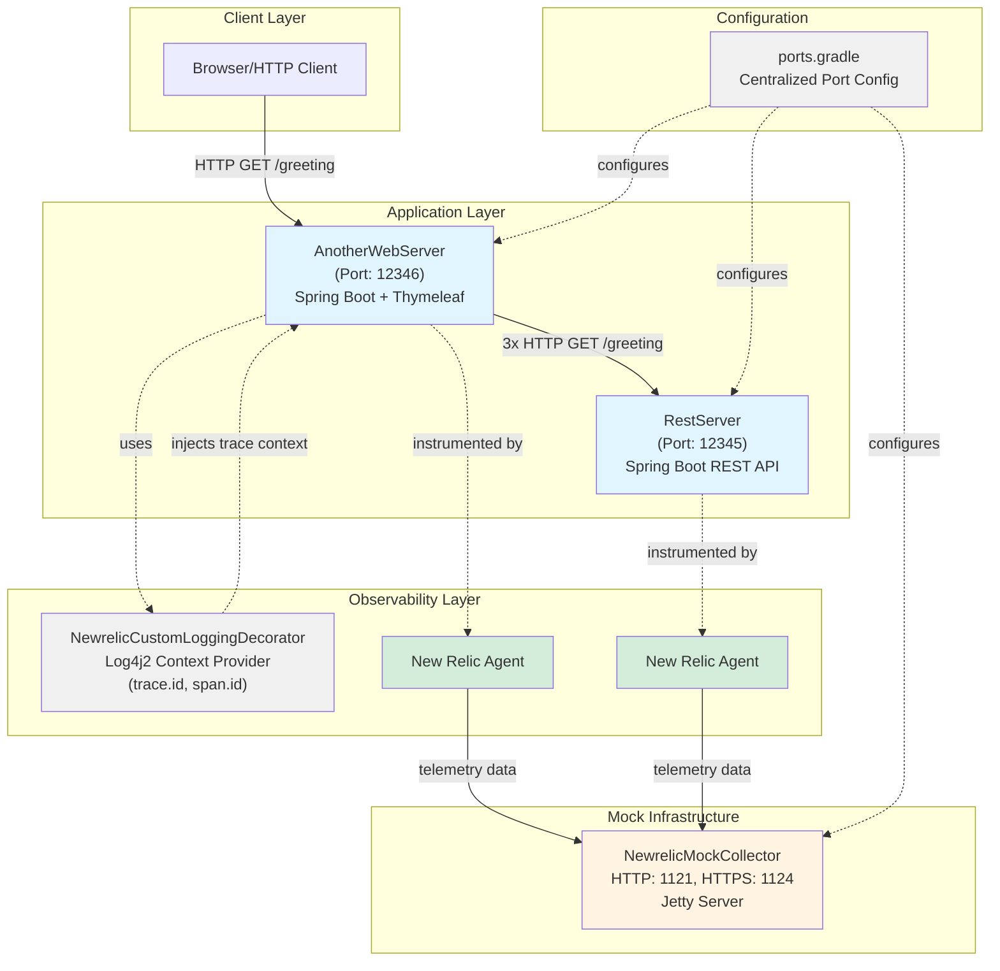

# New Relic Distributed Tracing Example Suite

[](https://openjdk.java.net/)
[](https://gradle.org/)
[](https://newrelic.com/)

> **Learn New Relic instrumentation without a license.** This demo suite includes a **mock collector** that captures all agent telemetry locally—perfect for learning, testing, and development.

## 🚀 Quick Start

```bash
# Clone and build
git clone https://github.com/rdara/newrelic.git
cd newrelic
./gradlew build

# Terminal 1: Start mock collector
./gradlew :NewrelicMockCollector:run

# Terminal 2: Start backend service
./gradlew :RestServer:run

# Terminal 3: Start frontend service
./gradlew :AnotherWebServer:run

# Terminal 4: Trigger a trace
curl http://localhost:12346/greeting
```

Check the logs in RestServer and AnotherWebServer terminals—you'll see matching `trace.id` values proving distributed trace propagation! 🎉

## 📚 Related Articles

This repository accompanies a LinkedIn article series on New Relic observability:

| # | Article | Topic |
|---|---------|-------|
| 1 | [Observability Made Easy: New Relic Quick Start](https://linkedin.com/in/rameshdara) | Getting started journey |
| 2 | [New Relic Logging Configuration](https://linkedin.com/in/rameshdara) | forwarding vs local_decorating |
| 3 | [Custom Configuration](https://linkedin.com/in/rameshdara) | Extending AgentConfigImpl |
| 4 | [Temp Files Challenge](https://linkedin.com/in/rameshdara) | Windows deleteOnExit issue |
| 5 | [OOM Issue - Fixed](https://linkedin.com/in/rameshdara) | httpasyncclient4 memory leak |
| 6 | [Distributed Tracing](https://linkedin.com/in/rameshdara) | Zero-cost trace correlation |
| 7 | [Mock Collector](https://linkedin.com/in/rameshdara) | Testing without a license |
| 8 | [Discard Sending Data](https://linkedin.com/in/rameshdara) | Zero egress instrumentation |
| 9 | [Control Data Ingestion Costs](https://linkedin.com/in/rameshdara) | Strategic cost optimization |
| 10 | [Late Stage Ingestion Control](https://linkedin.com/in/rameshdara) | DROP_DATA without redeployment |

## ✨ Key Features

- **🔌 No License Required**: Mock collector simulates New Relic APIs locally
- **🔗 Distributed Tracing**: See trace.id/span.id propagate across services
- **📝 Log Decoration**: Custom Log4j2 provider enriches logs with trace context
- **💰 Cost Optimization**: Demonstrates log-based tracing (free) vs span table (paid)
- **⚙️ Centralized Config**: All ports managed in `ports.gradle`

## Table of Contents

- [Overview](#overview)
- [Architecture](#architecture)
- [Key Concepts](#key-concepts)
- [Prerequisites](#prerequisites)
- [Getting Started](#getting-started)
- [Modules](#modules)
- [Troubleshooting](#troubleshooting)
- [License](#license)

## Overview

The suite consists of three main modules that simulate and demonstrate distributed tracing across services. It uses a mock New Relic collector to ingest telemetry data locally, enabling experimentation with trace context propagation and custom logging.

## Architecture



### Architecture Components

- **AnotherWebServer**: Entry point web application that makes multiple HTTP calls to RestServer, demonstrating distributed trace propagation
- **RestServer**: Backend REST API service that handles greeting requests
- **NewrelicCustomLoggingDecorator**: Custom Log4j2 context provider that enriches logs with New Relic trace and span IDs
- **NewrelicMockCollector**: Local mock implementation of New Relic collector API for development/testing without a production license
- **New Relic Agents**: Java agents attached to both servers via `-javaagent` flag, automatically instrumenting code and sending telemetry
- **ports.gradle**: Centralized configuration file managing all port assignments across modules

## Key Concepts

- **Distributed Tracing**: Trace context (e.g., `trace.id` and `span.id`) propagates across service boundaries, allowing reconstruction of end-to-end request flows via logs.
- **Custom Logging**: Log entries are decorated with trace identifiers for easier analysis.
- **Separation of Concerns**: Each module is independent and reusable, focusing on specific responsibilities like collector simulation or service logic.

## Prerequisites

- Java 11 or later
- Gradle 7.x or later
- OpenSSL (for generating self-signed certificates, if needed for HTTPS testing)

## Getting Started

### 1. Clone and Build

From the root directory:

```sh
git clone <repository-url>
cd newrelic
./gradlew build
```


### 2. Generate Self-Signed Certificate (Optional for HTTPS)
   Follow the steps in NewrelicMockCollector/README.md to generate server.cer and keystore.jks.

### 3. Run the Mock Collector

```sh
cd NewrelicMockCollector
./gradlew run
```   
   This starts the mock collector on ports 1121 (HTTP) and 1124 (HTTPS).

### 4. Run Example Servers
   Start each in separate terminals:
```sh   
cd RestServer
./gradlew run
```
```sh
cd AnotherWebServer
./gradlew run
```
### 5. Inspect Distributed Traces
-  Trigger requests to AnotherWebServer endpoints (e.g., via curl or a browser).
-  It calls RestServer, propagating trace context.
-  Check logs in both servers for trace.id and span.id to follow the trace.

## Modules
-  NewrelicMockCollector: A mock New Relic collector API for local telemetry ingestion. Supports HTTP/HTTPS with configurable ports and keystore. See NewrelicMockCollector/README.md for details.
-  RestServer: A RESTful service that emits telemetry and participates in traces. Integrates with the mock collector and decorates logs with trace IDs.
-  AnotherWebServer: A web server that calls RestServer endpoints, generating cross-service traces. Also decorates logs for observability.

## Troubleshooting
-  Port Conflicts: Ensure ports 1121, 1124, 12345, and 12346 are free. The mock collector checks availability on startup. All ports are configured in `ports.gradle`.
-  Certificate Errors: Verify server.cer and keystore.jks are in NewrelicMockCollector/src/main/resources/ with the correct password (changeit).
-  No Response Errors: Confirm the mock collector is running and the New Relic agent is configured (e.g., in RestServer/build.gradle).
-  Build Issues: Run ./gradlew clean build and ensure Java/Gradle versions match prerequisites.
 
For more details, refer to each module's README.md.

## License
   MIT or as specified in each submodule.
